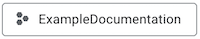
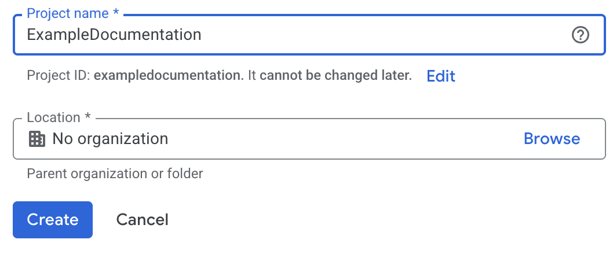

# Access Google Analytics Data Programmatically

The [Google Analytics Data API](https://developers.google.com/analytics/devguides/reporting/data/v1/rest) allows you to programmatically access your Google Analytics data. This can be useful if you're working in analytics, product development, marketing, or UX optimization, and want to do things like; automate data extraction, integrate analytics data into your applications, or perform advanced data analysis.

This guide describes how to set up a Google Cloud project with the appropriate credentials to use the Google Analytics Data API.

## Step 1: Create Google Cloud Project

To create a Google Cloud project:

1. Go to [Google Cloud Console](https://console.cloud.google.com/).

2. Click on the **Open Project Picker** button { width="150" } in the top left corner.

3. Click on the **New Project** button.

4. Enter the following information:
   - **Project name**
   - If applicable, your **Organization**.
   - If applicable, a **Location**.

    

5. Click **Create** to create the project.

!!! note
    
    If you have several Google accounts, make sure you are logged in with the account that you want to connect the project to.


## Step 2: Enable Google Analytics Data API

To enable the Google Analytics Data API for your project:

1. Click on the **Open Project Picker** button { width="150" } in the top left corner and select your **new project**.

2. Click on the hamburger menu in the top left corner and select **APIs & Services** > **Enable APIs & Services**.

3. Click on the **+ Enable APIs and Services** button.

4. Enter **Google Analytics Data API** in the search bar and press **Enter**.

5. Select **Google Analytics Data API** from the results.

6. Click **Enable** to enable the API for your project.


## Step 3: Create a Service Account and Keys

API credentials are required to authenticate your requests.

To create a service account and generate a key:

1.  Click on the hamburger menu in the top left corner and select **IAM & Admin** > **Service Accounts**.

2.  Click the **+ Create Service Account** button.

3.  Enter the **Service account name**, **Service account ID** and **Service account description**. Then click **Create and Continue**:
    
4.  Set **Permissions** to **Owner**.

    !!! note
        
        You do not need to set any **Principals**.

5.  Click **Done** to create the service account.

6.  Click on the newly created service account.
    
    For example: **example-documentation@exampledocumentation.iam.gserviceaccount.com**.

7.  Click **Add key** > **Create new key** and select **JSON**. A JSON file with the key is downloaded to your computer.

    !!! warning
        
        Make sure that you store the key safely. It will have access to all Google Analytics properties that you grant.

## Step 4:Grant Access to the Service Account

For the service account to access your Google Analytics data, you need to grant access to the Google Analytics property.

To grant access to the service account:

1. Open the Google Analytics 4 property that you want to connect to.

2. Click on **Admin** in the bottom left corner.

3. In the **Property** column, click on **Property Access Management**.

4. Click the **+** button to add a new user.

5. Enter the service account client-email address, for example: **example-documentation@exampledocumentation.iam.gserviceaccount.com**.

!!! note
    
    You can share this email account with business partners and other users that you want to have access to your analytics data. There are no secrets or keys included in the email address.

## Step 5: Validation

You can validate that you can get data from the Google Analytics Data API by querying the number of active users in the last 7 days using curl and the Google Analytics Data API (GA4) endpoint `runReport`.

The `runReport` endpoint is used to fetch analytics data, like user counts, sessions, countries, events for a Google Analytics property. For information about the request and response structure, see the [`runReport`](https://developers.google.com/analytics/devguides/reporting/data/v1/rest/v1beta/properties/runReport) documentation.


To validate that you can access the Google Analytics Data API:

1. Create an access token using the service account key file you downloaded earlier. You can use the Google OAuth 2.0 Playground or a command line tool like `curl` to obtain an access token:

    ```bash
    export GOOGLE_APPLICATION_CREDENTIALS="YOUR_KEY_FILE.json"
    ACCESS_TOKEN=$(curl -s \
    -X POST \
    -H "Content-Type: application/json" \
    -d @<(jq -n --argjson creds "$(cat $GOOGLE_APPLICATION_CREDENTIALS)" '{
        client_email: $creds.client_email,
        private_key: $creds.private_key,
        token_uri: $creds.token_uri
        } | {
        "iss": .client_email,
        "scope": "https://www.googleapis.com/auth/analytics.readonly",
        "aud": .token_uri,
        "exp": (now|floor + 3600),
        "iat": (now|floor)
        } | @json') \
    https://oauth2.googleapis.com/token | jq -r '.access_token')
    ```

2. Get your Google Analytics property ID. You can find this in the Google Analytics Admin section under **Property Settings**. It usually looks like `G-XXXXXXXXXX`.

3. Use the below curl command. Replace `YOUR_PROPERTY_ID` with your actual Google Analytics property ID and `YOUR_ACCESS_TOKEN` with the access token you created.

    ```bash
    curl -X POST \
    "https://analyticsdata.googleapis.com/v1beta/properties/YOUR_PROPERTY_ID:runReport" \
    -H "Authorization: Bearer $ACCESS_TOKEN" \
    -H "Content-Type: application/json" \
    -d '{
        "dimensions": [{"name": "date"}, {"name": "country"}],
        "metrics": [{"name": "activeUsers"}],
        "dateRanges": [{"startDate": "7daysAgo", "endDate": "today"}]
    }'
    ```

    The output will looks as shown below. For more information on the respons structure see the Google documentation [RunReportResponse](https://developers.google.com/analytics/devguides/reporting/data/v1/rest/v1beta/RunReportResponse).

    ```json
    {
    "dimensionHeaders": [
        {"name": "date"},
        {"name": "country"}
    ],
    "metricHeaders": [
        {"name": "activeUsers", "type": "TYPE_INTEGER"}
    ],
    "rows": [
        {
        "dimensionValues": [{"value": "20250717"}, {"value": "United States"}],
        "metricValues": [{"value": "1234"}]
        },
        ...
    ]
    }
    ```
    
