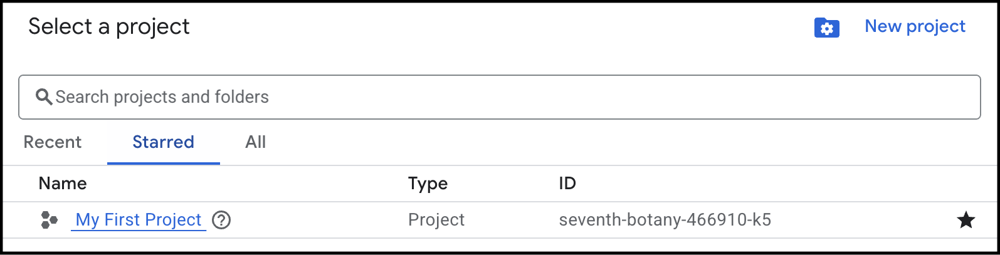

# Access Google Analytics Data Programmatically

The [Google Analytics Data API](https://developers.google.com/analytics/devguides/reporting/data/v1/rest) allows you to programmatically access your Google Analytics data. This can be useful if you want to do things like; automate data extraction, integrate analytics data into your applications, or perform advanced data analysis.

This guide describes how to set up a Google Cloud project with the appropriate credentials, to enable fetching data using the Google Analytics Data API.

## Prerequisites

- A [Google Analytics property](https://support.google.com/analytics/answer/9355666?hl=en) to set up access to.
- gcloud command line tool installed. See the [gcloud installation guide](https://cloud.google.com/sdk/docs/install) for instructions.

## Step 1: Create Google Cloud Project

To create a Google Cloud project:

1. Open the [Google Cloud Console](https://console.cloud.google.com/).

2. Click on the **Open Project Picker** button ({ width="200" }) in the top left corner.

3. Click on the **New Project** button.

    

4. Enter the following information:
   
      - **Project name**
      - If applicable, your **Organization**.
      - If applicable, a **Location**.

        { width="600" }

5. Click **Create**, to create the project.

    !!! note
        
        If you have several Google accounts, make sure you are logged in with the account that you want to connect the project to.


## Step 2: Enable Google Analytics Data API

To enable the Google Analytics Data API for your project:

1. The new Google Cloud project is not automatically opened in the Console. To open the project, click on the **Open Project Picker** button ({ width="200" }) in the top left corner and select the project.

2. Click on the hamburger menu in the top left corner and select **APIs & Services** > **Enable APIs & Services**.

    { width="400" }

3. Click on the **+ Enable APIs and Services** button.

4. Enter **Google Analytics Data API** in the search bar and press **Enter**.
    
    

5. Click on **Google Analytics Data API**.

6. Click on the **Enable** button, to enable the API for your project.


## Step 3: Create Service Account and Keys

API credentials are required to authenticate your requests. To create a service account and generate a key:

1. Click on the hamburger menu in the top left corner and select **IAM & Admin** > **Service Accounts**.

    { width="400" }

2. Click the **+ Create Service Account** button.

3. In the **Create service account** field, fill in fields:

    - **Service account name**
    - **Service account ID** (generated automatically)
    - **Service account description**.

    { width="500" }

4. Click **Create and continue**.

5. Set **Permissions** to **Owner**.

    { width="600" }

6. Do not set any **Principals with access**.

7. Click **Done** to create the service account.

8. Click on the newly created service account.
    
    For example: **example-documentation@exampledocumentation.iam.gserviceaccount.com**.

9.  Click **Add key** > **Create new key** and select **JSON**. A JSON file with the key is downloaded to your computer.

    !!! warning
        
        Make sure that you store the key safely. This key provides access to all Google Analytics properties that you have granted.

## Step 4:Grant Access to the Service Account

For the service account to access your Google Analytics data, you need to grant access to the Google Analytics property.

To grant access to the service account:

1. Open [Google Analytics](https://analytics.google.com/).

2. Open the Google Analytics property that you want to connect to. Select the name of the property in the top right of Google Analytics. In the following image, the property is called **GA4 - Google Merch Shop**.

    { width="550" }

3. Click on **Admin** in the bottom left corner.

4. In the **Property** column, click on **Property Access Management**.

    { width="300" }

5. Click the **+** button to add a new user.

6. Enter the service account, in this example **example-documentation@exampledocumentation.iam.gserviceaccount.com**, and then click **Add**.

    !!! note
        
        You can share this email account with business partners and other users that you want to have access to your analytics data. There are no secrets or keys included in the email address.

## Step 5: Validation

You should now be able to access data by calling the Google Analytics Data API. To validate this, we will query the number of active users in the last 7 days by calling the `runReport` endpoint using curl.

The `runReport` endpoint is used to fetch analytics data, like user counts, sessions, countries, and events for a Google Analytics property. For full information on the endpoints request and response structure, see the [`runReport`](https://developers.google.com/analytics/devguides/reporting/data/v1/rest/v1beta/properties/runReport) documentation.

To call `runReport` using curl:

1. Create an access token using gcloud and the JSON service account key file you downloaded in [Create Service Account and Keys](#step-3-create-service-account-and-keys). 
   
    Execute the commands below in your terminal. Replace `your-service-account-key.json` with the path to your service account key file.

    ```bash
    gcloud auth activate-service-account --key-file=your-service-account-key.json
    
    gcloud auth print-access-token
    ```

    This will print the token you can use in the `Authorization: Bearer <YOUR_ACCESS_TOKEN>` header.

2. Get your Google Analytics **Property ID**. You can find it in the Google Analytics **Admin** section under **Property Settings**. It has the following format: `G-XXXXXXXXXX`.

3. Use the below curl command to make the call. Replace `YOUR_PROPERTY_ID` with your Google Analytics property ID, and `YOUR_ACCESS_TOKEN` with the access token you created.

    ```bash
    curl -X POST \
    "https://analyticsdata.googleapis.com/v1beta/properties/YOUR_PROPERTY_ID:runReport" \
    -H "Authorization: Bearer $YOUR_ACCESS_TOKEN" \
    -H "Content-Type: application/json" \
    -d '{
        "dimensions": [{"name": "date"}, {"name": "country"}],
        "metrics": [{"name": "activeUsers"}],
        "dateRanges": [{"startDate": "7daysAgo", "endDate": "today"}]
    }'
    ```
    In the above example we use fields `dimensions`, `metrics`, and `dateRanges` to specify the data we want to retrieve. The dimensions are `date` and `country`, the metric is `activeUsers`, and the date range is set to the last 7 days. 
    
    More fields can be added to the request, see the [`runReport`](https://developers.google.com/analytics/devguides/reporting/data/v1/rest/v1beta/properties/runReport) documentation for more information.

4. You should receive an output similar to what is shown below. For more information on the respons structure of `runReport` see the [RunReportResponse](https://developers.google.com/analytics/devguides/reporting/data/v1/rest/v1beta/RunReportResponse) documentation.

    ```json
    {
    "dimensionHeaders": [
        {"name": "date"},
        {"name": "country"}
    ],
    "metricHeaders": [
        {"name": "activeUsers", "type": "TYPE_INTEGER"}
    ],
    "rows": [
        {
        "dimensionValues": [{"value": "20250717"}, {"value": "United States"}],
        "metricValues": [{"value": "1234"}]
        },
        ...
    ]
    }
    ```


