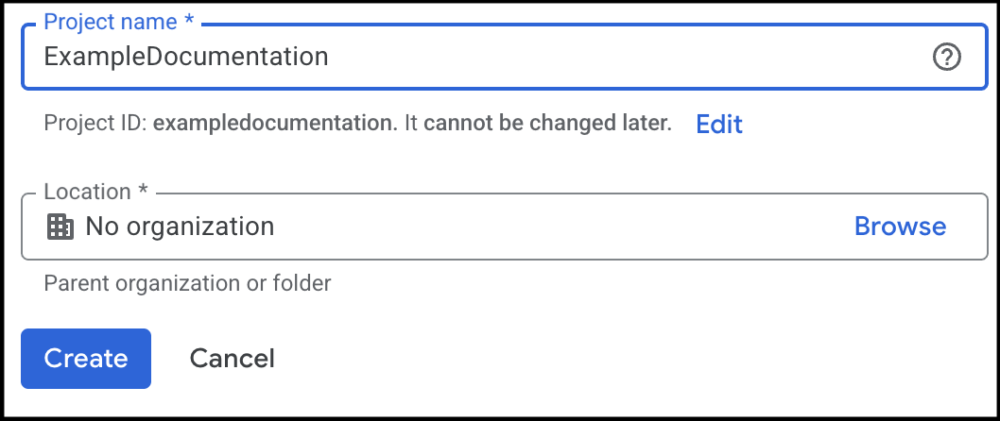

# Access Google Analytics Data Programmatically

This guide describes how to set up [Google Cloud](https://console.cloud.google.com/) and the [Google Analytics Data API](https://developers.google.com/analytics/devguides/reporting/data/v1/rest) to provide access to your Google Analytics data programmatically.

This is useful if you want to, for example, automate data extraction, integrate analytics data into your applications, or perform advanced data analysis.

To use the Google Analytics Data API:

1. Set up a Google Cloud project.
2. Enable the Google Analytics Data API.
3. Create a service account and key.
4. Grant access to the service account.


## Step 1: Set Up Google Cloud Project

To use the Google Analytics API, you need a Google Cloud project with appropriate credentials.

To create a Google Cloud project:

1. Go to [Google Cloud Console](https://console.cloud.google.com/).

2. Click on the **Open Project Picker** button  in the top left corner.

3. Click on the **New Project** button .

4. Enter the following information:
   - **Project name**
   - If applicable, your **Organization**.
   - If applicable, a **Location**.

    

5. Click **Create** to create the project.

!!! note
    
    If you have several Google accounts, make sure you are logged in with the account that has permission to create projects in your organization and that you want to connect the project to.


## Enable the Google Analytics Data API

To enable the Google Analytics Data API for your project:

1. Click on the **Open Project Picker** button { width="100" } in the top left corner and select your **new project**.

2. Click on the hamburger menu in the top left corner and select **APIs & Services** > **Enable APIs & Services**.

3. Click on the **+ Enable APIs and Services** button.

4. Enter **Google Analytics Data API** in the search bar and select it from the results.

5. Click **Enable** to enable the API for your project.


## Create a Service Account and Keys

API credentials are required to authenticate your requests.

To create a service account and generate a key:

1.  Click on the hamburger menu in the top left corner and select **IAM & Admin** > **Service Accounts**.

2.  Click the **+ Create Service Account** button.

3.  Enter the following information and click **Create and Continue**:
    - **Service account name**
    - **Service account ID**
    - **Service account description**
    
4.  Set **Permissions** to **Owner**.

    You do not need to set **Principals** with access to the service account.

5.  Click **Done** to create the service account.

6.  Click on the newly created service account, for example: **example-documentation@exampledocumentation.iam.gserviceaccount.com**.

7.  Click **Add key** > **Create new key** and select **JSON**. A JSON file with the key is downloaded to your computer.

    !!! warning
        
        Make sure that you store the key safely. It will have access to all Google Analytics properties that you grant.

## Grant Access to the Service Account

To allow the service account to access your Google Analytics data, you need to grant it access to the Google Analytics property:

1. Open the Google Analytics 4 property that you want to connect to.
2. Click on **Admin** in the bottom left corner.
3. In the **Property** column, click on **Property Access Management**.
4. Click the **+** button to add a new user.
5. Enter the service account client-email address, for example: **example-documentation@exampledocumentation.iam.gserviceaccount.com**.

!!! note
    
    You can share this email account with business partners and other users that you want to have access to your analytics data. There are no secrets or keys included in the email address.

## Validation

In this section we will validate that we can get data from the Google Analytics Data API by querying the number of active users in the last 7 days using curl.

A common and very practical API call to the Google Analytics Data API (GA4) is the [`runReport`](https://developers.google.com/analytics/devguides/reporting/data/v1/rest/v1beta/properties/runReport) endpoint. It’s used to fetch analytics data (like user counts, sessions, countries, events) for a GA4 property.

```bash
POST https://analyticsdata.googleapis.com/v1beta/properties/PROPERTY_ID:runReport
```

To validate that you can access the Google Analytics Data API, you can use the following curl command. Make sure to replace `YOUR_PROPERTY_ID` with your actual Google Analytics property ID and `YOUR_ACCESS_TOKEN` with a valid OAuth 2.0 access token.

```bash
curl -X POST \
  "https://analyticsdata.googleapis.com/v1beta/properties/YOUR_PROPERTY_ID:runReport" \
  -H "Authorization: Bearer $ACCESS_TOKEN" \
  -H "Content-Type: application/json" \
  -d '{
    "dimensions": [{"name": "date"}, {"name": "country"}],
    "metrics": [{"name": "activeUsers"}],
    "dateRanges": [{"startDate": "7daysAgo", "endDate": "today"}]
  }'
```

Sample Output:

```json
{
  "dimensionHeaders": [
    {"name": "date"},
    {"name": "country"}
  ],
  "metricHeaders": [
    {"name": "activeUsers", "type": "TYPE_INTEGER"}
  ],
  "rows": [
    {
      "dimensionValues": [{"value": "20250717"}, {"value": "United States"}],
      "metricValues": [{"value": "1234"}]
    },
    ...
  ]
}
```
https://developers.google.com/analytics/devguides/reporting/data/v1/rest/v1beta/RunReportResponse

Get the token via curl and jq:

```bash
export GOOGLE_APPLICATION_CREDENTIALS="YOUR_KEY_FILE.json"
ACCESS_TOKEN=$(curl -s \
  -X POST \
  -H "Content-Type: application/json" \
  -d @<(jq -n --argjson creds "$(cat $GOOGLE_APPLICATION_CREDENTIALS)" '{
      client_email: $creds.client_email,
      private_key: $creds.private_key,
      token_uri: $creds.token_uri
    } | {
      "iss": .client_email,
      "scope": "https://www.googleapis.com/auth/analytics.readonly",
      "aud": .token_uri,
      "exp": (now|floor + 3600),
      "iat": (now|floor)
    } | @json') \
  https://oauth2.googleapis.com/token | jq -r '.access_token')
  ```